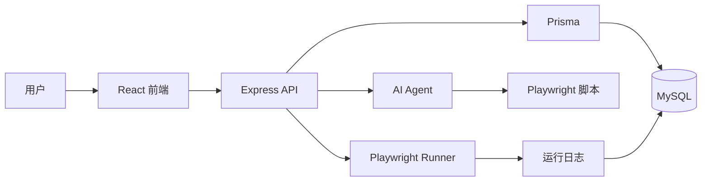
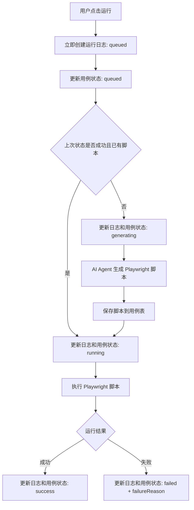

# AI 自动化测试平台开发文档

## 1. 目标

从 0 开始实现一个简洁的 AI 自动化测试平台。用户用自然语言维护端到端测试用例，后端通过 AI agent 生成 Playwright 脚本，并执行脚本得到测试结果。

技术栈：

- 前端：React + TypeScript + Ant Design + TailwindCSS，目录 `frontend`
- 后端：Express + Prisma + MySQL，目录 `backend`
- 测试执行：Playwright
- AI agent：初版先封装为一个函数，内部可先返回默认脚本，后续替换为真实 agent
- Prisma 使用 7.6.0，schema 采用 `provider = "prisma-client-js"`，后端从 `@prisma/client` 引入 `PrismaClient`，不把生成客户端输出到 `src/generated`。

初版只做核心功能，不做登录、权限、多项目切换、队列系统、分布式执行和复杂报表。

## 2. 页面设计

### 2.1 看板

展示内容：

- 成功率：只统计每个用例最新一次运行状态
- 用例总数
- 最近失败用例列表

最近失败用例字段：

- 用例名称
- 分组：下拉选择，可新建分组
- 失败原因

成功率计算：

```ts
successRate = totalCases === 0 ? 0 : successCases / totalCases * 100
```

### 2.2 用例管理

列表字段：

- 用例名称：点击后打开详情/编辑弹窗
- 分组
- 状态
- 操作：运行、删除

状态：

| 状态 | 前端文案 | 说明 |
|---|---|---|
| `not_run` | 未运行 | 用例从未执行过 |
| `queued` | 排队中 | 用户已点击运行，后端已创建运行记录，等待处理 |
| `generating` | 用例生成中 | AI agent 正在生成或更新 Playwright 脚本 |
| `running` | 运行中 | Playwright 脚本正在执行 |
| `success` | 成功 | 最近一次运行成功 |
| `failed` | 失败 | 最近一次运行失败 |

失败状态支持点击查看失败原因。

### 2.3 新增/编辑用例弹窗

新增和编辑使用同一个弹窗。

左侧：用例基本信息

- 标题
- 分组
- 测试步骤：自然语言用例，可编辑

右侧：Playwright 脚本

- 默认隐藏
- 点击后展开
- 可再次收起
- 脚本内容可编辑并保存

保存后同时保存自然语言用例和 Playwright 脚本。

### 2.4 配置页面

初版只维护一条项目配置：

- 项目名称
- baseUrl

## 3. 架构设计



职责划分：

- 前端负责页面展示、表单编辑、运行操作和状态轮询
- Express 提供接口，处理用例、项目配置和运行日志
- Prisma 负责数据库读写
- AI agent 根据自然语言用例生成 Playwright 脚本
- Playwright Runner 负责把数据库中的脚本写入临时 spec 文件并执行

## 4. 运行流程



运行规则：

- 用户点击运行后，立即创建 `RunLog.status = queued`
- 同时更新 `TestCase.status = queued`
- 如果用例上次状态是 `success` 且已有 `playwrightScript`，跳过 AI agent，直接运行脚本
- 如果用例状态是 `failed`、`not_run`，或脚本为空，先进入 `generating`，再调用 AI agent 生成脚本
- Playwright 执行前进入 `running`
- 执行结束后更新为 `success` 或 `failed`

## 5. 数据库设计

### 5.1 Project

初版只使用一条项目配置。

| 字段 | 类型 | 说明 |
|---|---|---|
| id | Int PK | 项目 ID |
| name | String | 项目名称 |
| baseUrl | String | 测试基础地址 |
| createdAt | DateTime | 创建时间 |
| updatedAt | DateTime | 更新时间 |

### 5.2 TestCaseGroup

| 字段 | 类型 | 说明 |
|---|---|---|
| id | Int PK | 分组 ID |
| name | String unique | 分组名称 |
| createdAt | DateTime | 创建时间 |
| updatedAt | DateTime | 更新时间 |

### 5.3 TestCase

| 字段 | 类型 | 说明 |
|---|---|---|
| id | Int PK | 用例 ID |
| title | String | 用例名称 |
| groupId | Int FK | 分组 ID |
| naturalLanguage | Text | 自然语言测试步骤 |
| playwrightScript | LongText? | Playwright 脚本 |
| status | Enum | `not_run` / `queued` / `generating` / `running` / `success` / `failed` |
| lastFailureReason | Text? | 最近一次失败原因 |
| lastRunAt | DateTime? | 最近运行时间 |
| createdAt | DateTime | 创建时间 |
| updatedAt | DateTime | 更新时间 |

### 5.4 RunLog

| 字段 | 类型 | 说明 |
|---|---|---|
| id | Int PK | 日志 ID |
| testCaseId | Int FK | 用例 ID |
| status | Enum | `queued` / `generating` / `running` / `success` / `failed` |
| failureReason | Text? | 失败原因 |
| stdout | LongText? | Playwright 标准输出 |
| stderr | LongText? | Playwright 错误输出 |
| startedAt | DateTime | 用户点击运行的时间 |
| finishedAt | DateTime? | 结束时间 |

## 6. Prisma Schema 草案

```prisma
generator client {
  provider            = "prisma-client"
  output              = "../src/generated/prisma"
  moduleFormat        = "esm"
  importFileExtension = "js"
}

datasource db {
  provider = "mysql"
}

enum TestCaseStatus {
  not_run
  queued
  generating
  running
  success
  failed
}

enum RunLogStatus {
  queued
  generating
  running
  success
  failed
}

model Project {
  id        Int      @id @default(autoincrement())
  name      String
  baseUrl   String
  createdAt DateTime @default(now())
  updatedAt DateTime @updatedAt
}

model TestCaseGroup {
  id        Int        @id @default(autoincrement())
  name      String     @unique
  createdAt DateTime   @default(now())
  updatedAt DateTime   @updatedAt
  testCases TestCase[]
}

model TestCase {
  id                Int            @id @default(autoincrement())
  title             String
  groupId           Int
  group             TestCaseGroup  @relation(fields: [groupId], references: [id])
  naturalLanguage   String         @db.Text
  playwrightScript  String?        @db.LongText
  status            TestCaseStatus @default(not_run)
  lastFailureReason String?        @db.Text
  lastRunAt         DateTime?
  createdAt         DateTime       @default(now())
  updatedAt         DateTime       @updatedAt
  runLogs           RunLog[]

  @@index([groupId])
}

model RunLog {
  id            Int          @id @default(autoincrement())
  testCaseId    Int
  testCase      TestCase     @relation(fields: [testCaseId], references: [id], onDelete: Cascade)
  status        RunLogStatus
  failureReason String?      @db.Text
  stdout        String?      @db.LongText
  stderr        String?      @db.LongText
  startedAt     DateTime     @default(now())
  finishedAt    DateTime?

  @@index([testCaseId])
}
```

## 7. 接口设计

### 7.1 看板

`GET /api/dashboard`

返回：

```ts
{
  successRate: number;
  totalCases: number;
  recentFailedCases: Array<{
    id: number;
    title: string;
    groupName: string;
    failureReason: string;
  }>;
}
```

规则：

- 成功率只统计用例最新状态
- 最近失败用例按 `lastRunAt desc` 返回

### 7.2 用例列表

`GET /api/test-cases`

返回：

```ts
Array<{
  id: number;
  title: string;
  groupId: number;
  groupName: string;
  status: "not_run" | "queued" | "generating" | "running" | "success" | "failed";
  lastFailureReason?: string;
  lastRunAt?: string;
}>
```

### 7.3 用例详情

`GET /api/test-cases/:id`

返回：

```ts
{
  id: number;
  title: string;
  groupId: number;
  groupName: string;
  naturalLanguage: string;
  playwrightScript?: string;
  status: "not_run" | "queued" | "generating" | "running" | "success" | "failed";
  lastFailureReason?: string;
  lastRunAt?: string;
}
```

### 7.4 创建用例

`POST /api/test-cases`

请求：

```ts
{
  title: string;
  groupId: number;
  naturalLanguage: string;
  playwrightScript?: string;
}
```

说明：

- 默认状态为 `not_run`

### 7.5 更新用例

`PUT /api/test-cases/:id`

请求：

```ts
{
  title: string;
  groupId: number;
  naturalLanguage: string;
  playwrightScript?: string;
}
```

### 7.6 用例分组

`GET /api/test-case-groups`

返回：

```ts
Array<{
  id: number;
  name: string;
  createdAt: string;
  updatedAt: string;
}>
```

`POST /api/test-case-groups`

请求：

```ts
{
  name: string;
}
```

`DELETE /api/test-case-groups/:id`

说明：

- 只允许删除没有用例的分组

### 7.7 删除用例

`DELETE /api/test-cases/:id`

说明：

- 删除用例
- 同时删除该用例的运行日志

### 7.8 运行用例

`POST /api/test-cases/:id/run`

返回：

```ts
{
  runId: number;
}
```

后端处理：

```ts
async function runTestCase(testCaseId: number) {
  const testCase = await getTestCase(testCaseId);

  const runLog = await createRunLog({
    testCaseId,
    status: "queued",
  });

  await updateTestCaseStatus(testCaseId, "queued");

  runInBackground(async () => {
    let script = testCase.playwrightScript;

    if (testCase.status !== "success" || !script) {
      await updateRunStatus(runLog.id, testCaseId, "generating");
      script = await generateScript(testCase);
      await saveScript(testCaseId, script);
    }

    await updateRunStatus(runLog.id, testCaseId, "running");
    const result = await runPlaywright(script);

    if (result.success) {
      await markSuccess(runLog.id, testCaseId, result);
    } else {
      await markFailed(runLog.id, testCaseId, result);
    }
  });

  return { runId: runLog.id };
}
```

### 7.9 查询运行日志

`GET /api/run-logs/:id`

返回：

```ts
{
  id: number;
  testCaseId: number;
  status: "queued" | "generating" | "running" | "success" | "failed";
  failureReason?: string;
  stdout?: string;
  stderr?: string;
  startedAt: string;
  finishedAt?: string;
}
```

### 7.10 获取项目配置

`GET /api/project`

返回：

```ts
{
  id: number;
  name: string;
  baseUrl: string;
}
```

### 7.11 保存项目配置

`PUT /api/project`

请求：

```ts
{
  name: string;
  baseUrl: string;
}
```

## 8. 后端模块建议

目录：

```text
backend/
  prisma.config.ts
  prisma/
    schema.prisma
  src/
    index.ts
    prisma.ts
    routes/
      dashboard.ts
      project.ts
      testCaseGroups.ts
      testCases.ts
      runLogs.ts
    services/
      agentService.ts
      runnerService.ts
      testCaseRunService.ts
```

核心服务：

- `agentService.generateScript(testCase)`：根据自然语言生成 Playwright 脚本
- `runnerService.runPlaywright(script)`：写入临时 spec 文件并执行 Playwright
- `testCaseRunService.runTestCase(id)`：串联排队、生成、执行和状态更新

初版 `agentService` 可以先返回默认脚本：

```ts
export async function generateScript() {
  return `
import { test, expect } from '@playwright/test';

test('default test', async ({ page }) => {
  await page.goto('/');
  await expect(page).toHaveTitle(/.*/);
});
`;
}
```

## 9. 前端模块建议

目录：

```text
frontend/
  src/
    api/
      client.ts
      dashboard.ts
      project.ts
      testCases.ts
      runLogs.ts
    pages/
      DashboardPage.tsx
      TestCasePage.tsx
      ProjectSettingsPage.tsx
    components/
      TestCaseModal.tsx
      StatusTag.tsx
```

页面行为：

- 看板进入页面时请求 `/api/dashboard`
- 用例列表请求 `/api/test-cases`
- 用例弹窗使用 `/api/test-case-groups` 获取和新建分组
- 点击运行后调用 `/api/test-cases/:id/run`
- 运行后定时刷新列表或查询运行日志
- 状态为 `queued`、`generating`、`running` 时禁用重复运行
- 新增/编辑弹窗保存后刷新列表

## 10. 测试计划

后端接口测试：

- 点击运行后立即生成 `queued` 日志
- 创建分组后，可在新增/编辑用例弹窗中选择
- 创建/编辑用例时保存 `groupId`，列表和看板展示分组名称
- 删除已有用例的分组失败，删除空分组成功
- 未运行用例运行时从 `queued` 进入 `generating`，再进入 `running`
- 上次成功且有脚本的用例再次运行时跳过 agent，直接从 `queued` 进入 `running`
- 上次失败的用例再次运行时重新生成脚本
- 看板成功率只按用例最新状态计算

前端手工验收：

- 用例列表能展示 6 个状态
- 用例生成中时用户能看到明确状态
- 失败原因能在列表和详情中查看
- 新增/编辑弹窗左右两列正常，脚本区域默认隐藏并可展开
- 配置页可保存项目名称和 baseUrl

运行验收：

- 新建一条自然语言用例
- 点击运行后立即看到 `排队中`
- 进入 agent 阶段后看到 `用例生成中`
- Playwright 执行时看到 `运行中`
- 执行结束后看到 `成功` 或 `失败`
- 失败时可查看失败原因
